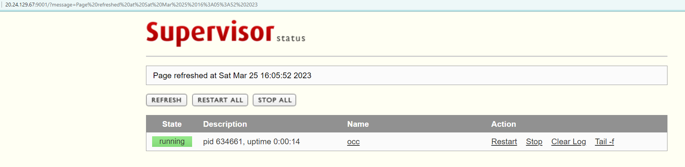

# OnlineCodeCompile

## 传统部署
### 安装python和Django

### [安装uWSGI](https://www.shantanuacharya.com/2020-12-09-deploy-django-nginx-uwsgi/)
uWSGI是一个实现了uwsgi协议的Web服务器  

#### 1. 安装uwsgi
```
sudo pip3 install uwsgi
```
#### 2. 编写配置文件
见目录 /OCC/uwsgi.ini
#### 3. 运行
uwsgi --ini uwsgi.ini的绝对路径  
#### 4. 测试 
curl http://localhost:8001

### 安装Supervisor
Supervisor是一个进程管理程序。当进程中断，Supervisor能自动重启它。
#### 1. 安装Supervisor
```
sudo apt-get install supervisor   //安装
sudo service supervisor start     //启动
sudo systemctl enable supervisor  //开机启动
sudo systemctl status supervisor  //查看状态
```
#### 2. 添加配置
```
sudo vi /etc/supervisor/supervisord.conf
```
增加如下配置
```
[inet_http_server]
port=0.0.0.0:9001
username=user
password=123

[include]
files = /etc/supervisor/conf.d/*.conf
```
```
sudo vi /etc/supervisor/conf.d/supervisor.conf
```
supervisor.conf
```
[program:occ]
command=uwsgi --ini /home/lavijiang/Hackathon/OnlineCodeCompile/OCC/uwsgi.ini
priority=1
numprocs=1
autostart=true
autorestart=true
startretries=2
startsecs=10
redirect_stderr=true
stdout_logfile=/home/lavijiang/Hackathon/OnlineCodeCompile/OCC/Poseidon/Poseidon.log
```
#### 3. 相关命令
```
sudo supervisorctl reload #重载配置并启动
```




### 使用Nginx进行代理
#### 1. install nginx
```
sudo apt-get install nginx
```

#### 2. start it 
```
sudo systemctl start nginx 
sudo systemctl restart nginx //restart
```

#### 3. check the status of Nginx
```
sudo systemctl status nginx
```

#### 4. conf file
```
/etc/nginx/nginx.conf
```

#### 5. high available
使用Keepalived软件来配置高可用Nginx集群